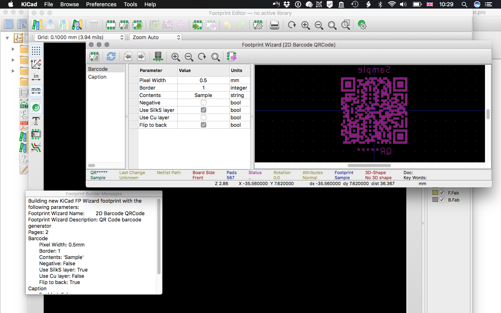
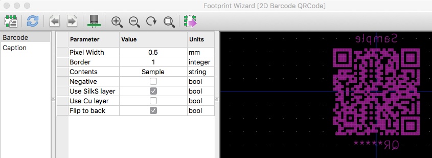
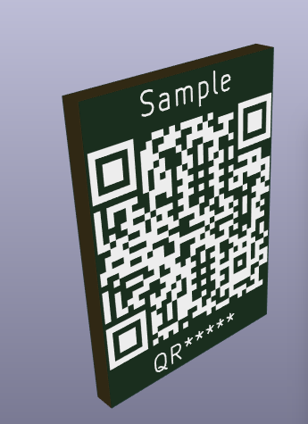

# qrcode_footprint_wizard
Updated QR Code generator script with option to place on back of board

The QR Code generator included in Kicad only permits placement on the front side of the board.
This version also allows placement on the back of the board, and mirrors the text and the QR Code.

